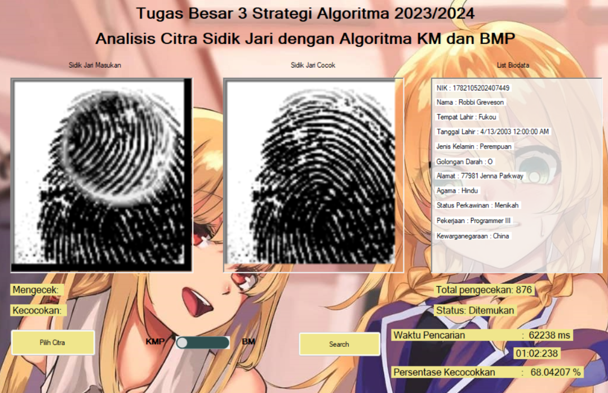

# 🕵️‍♂️🔍 Fingerprint Biometric Detection Desktop Application

> 🌐 Pattern Matching in Building a Biometric Based Individual Detection System Using Fingerprint Images

🎓 **Project Background:**
We created the Fingerprint Biometric Pattern Matching as part of my Algorithm Strategies third major assignment during my fourth semester in the Computer Science program at ITB.

## 🪪 Contributors
| Nama | NIM |
|---|---|
| Aland Mulia Pratama | 13522124 |
| Muhammad Zaki | 13522136 |
| Muhammad Rasheed Qais Tandjung | 13522158 |

## 📝 Description
In this digital era, the importance of data security and access is increasingly paramount. In facing these challenges, biometric technology, particularly fingerprint identification, has become an increasingly popular solution. Fingerprints are unique identifiers that cannot be replicated, making them a secure and reliable method of access. A crucial technique in fingerprint identification is pattern matching, which enables systems to match fingerprint patterns quickly and accurately. Algorithms such as Knuth-Morris-Pratt and Boyer-Moore are commonly used solutions in this process.

### Knuth-Morris-Pratt (KMP) Algorithms
The Knuth-Morris-Pratt (KMP) algorithm is an efficient pattern matching algorithm for searching for the presence of a pattern in text. This algorithm is named after its inventors, Donald Knuth, Vaughan Pratt, and James H. Morris. The main advantage of KMP is its ability to avoid unnecessary re-comparison by exploiting the information contained in the pattern itself. This makes it much faster than simpler pattern matching methods, such as brute force.

### Boyer-Moore (BM) Algorithms
The main component of the Boyer-Moore algorithm is the 'bad character' heuristic. When a character in the search string does not match a character in the text, this algorithm will look for the presence of that character in the search string. If the character is not found, the search string can jump as far as the length of the string. If a character is found in the search string, the string is skipped so that the last matching character in the search string aligns with the last position of the same character in the text.

## 🛠️ Requirements 
- Visual Studio (https://visualstudio.microsoft.com/vs/)
- MariaDB (https://mariadb.org/download)

## 🏃 How to Run
### Database Configuration
1. Clone the repository to your local files. Access the repository [here](repository-link).
2. Install the database dump (final.sql) on test directory.
3. Access MariaDB by executing `mysql -u root -p` on command prompt.
4. Create the database by run `create database stima;` on MariaDB Server.
5. Exit MariaDB by execute `exit;` and import the dump file by run the following `mysql -u root -p stima < [dump_name].sql`.
6. Start the database server:
    - On linux use `sudo systemctl start mariadb`
    - On windows use `net start mariadb`

### Desktop Application
1. Launch visual studio and open the cloned repository.
2. In Visual Studio, navigate to `File > Open > Project/Solution` and select the file `src/GUI/GUI.sln`.
3. In Visual Studio, click "Start" in the top center menu to run the program.

## 📸 Screenshots

  
  
<i>Antarmuka Pengguna Aplikasi Desktop</i>

## 🎥 Video

    
    
<i>Bonus Video Tugas Besar 3 Strategi Algoritma Kelompok C-Major</i>

