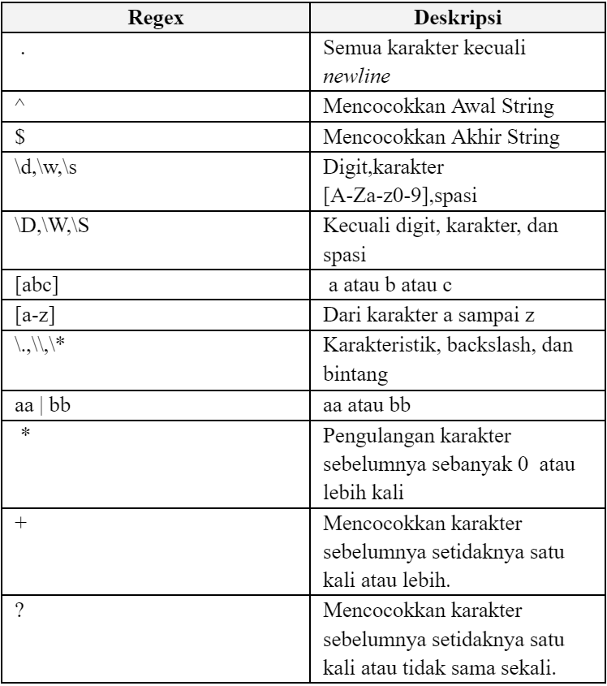

<p align="center">
  
</p>

<p align="center">
  
</p>


# 🕵️‍♂️🔍 Fingerprint Biometric Detection Desktop Application

> 🌐 Pattern Matching in Building a Biometric Based Individual Detection System Using Fingerprint Images

🎓 **Project Background:**
We created the Fingerprint Biometric Pattern Matching as part of my Algorithm Strategies third major assignment during my fourth semester in the Computer Science program at ITB.

## 🪪 Contributors
| Nama | NIM |
|---|---|
| Aland Mulia Pratama | 13522124 |
| Muhammad Zaki | 13522136 |
| Muhammad Rasheed Qais Tandjung | 13522158 |

## 📝 Description
In this digital era, the importance of data security and access is increasingly paramount. In facing these challenges, biometric technology, particularly fingerprint identification, has become an increasingly popular solution. Fingerprints are unique identifiers that cannot be replicated, making them a secure and reliable method of access. A crucial technique in fingerprint identification is pattern matching, which enables systems to match fingerprint patterns quickly and accurately. Algorithms such as Knuth-Morris-Pratt and Boyer-Moore are commonly used solutions in this process.

### Knuth-Morris-Pratt (KMP) Algorithm
The Knuth-Morris-Pratt (KMP) algorithm is an efficient pattern matching algorithm for searching for the presence of a pattern in text. This algorithm is named after its inventors, Donald Knuth, Vaughan Pratt, and James H. Morris. The main advantage of KMP is its ability to avoid unnecessary re-comparison by exploiting the information contained in the pattern itself. This makes it much faster than simpler pattern matching methods, such as brute force.

### Boyer-Moore (BM) Algorithm
The main component of the Boyer-Moore algorithm is the 'bad character' heuristic. When a character in the search string does not match a character in the text, this algorithm will look for the presence of that character in the search string. If the character is not found, the search string can jump as far as the length of the string. If a character is found in the search string, the string is skipped so that the last matching character in the search string aligns with the last position of the same character in the text.

### Regular Expressions
Regular Expression (REGEX) is a very useful method for searching and manipulating strings based on certain patterns. Regex allows users to define complex patterns in text, which can be used to perform very specific searches, validations, and split and replace operations on strings. Examples of permitted variations include uppercase and lowercase letters, numbers similar to letters which can be seen on image below.

<div align="center">
  
  <p><i>Regex Replacement Table</i></p>
</div>


## 🛠️ Requirements 
- Visual Studio (https://visualstudio.microsoft.com/vs/) (optional, if running with executable is possible)
- MariaDB (https://mariadb.org/download)

## 🏃 How to Run
### Database Configuration
1. Clone the repository to your local files. Access the repository [here](repository-link).
2. Install the database dump (`./data/final.sql`).
3. Access MariaDB by executing `mysql -u root -p` on command prompt.
4. Create the database by running `create database stima;` on MariaDB Server.
5. Exit MariaDB by execute `exit;` and import the dump file by run the following `mysql -u root -p stima < final.sql` (make sure the terminal is running in the same directory as final.sql).
6. Start the database server:
    - On linux use `sudo systemctl start mariadb`
    - On windows use `net start mariadb`

<br>
<b>Additional note:</b> The program will execute a connection query to the database server with the following query: 

```cs
private static string connectionString = "server=localhost;user=root;password=;database=stima";
private static MySqlConnection connection = new MySqlConnection(connectionString);
```

Please make sure your database server allows all privileges needed for the program to run. Take note of the username and password in the connection string as well. Modify the hardcoded connection string in `./src/GUI/GUI/Database/Database.cs` to match with your server username and password if needed.

### Dataset
This project primarily uses the following fingerprint dataset:
```
https://www.kaggle.com/datasets/ruizgara/socofing
```
For the program to run properly, please download the dataset given above to the `test` folder. Make sure all of the unaltered fingerprint images are directly contained in the `test` folder (not in a subdirectory in test), with all the default file names preserved.

### Desktop Application
1. Make sure the database server is already running, and the dataset given is already downloaded and in the `test` folder.
2. Open a terminal in the project (Windows/Linux), and move the terminal to the following directory:
```bash
cd src/GUI/GUI/bin/Release
```
3. Open the following file: `GUI.exe`

Alternatively, you can run the project using Visual Studio:

1. Launch visual studio and open the cloned repository.
2. In Visual Studio, navigate to `File > Open > Project/Solution` and select the file `src/GUI/GUI.sln`.
3. In Visual Studio, click "Start" in the top center menu to run the program.

## 📸 Screenshots

<div align="center">
  
  <p><i>Antarmuka Pengguna Aplikasi Desktop</i></p>
</div>

## 🎥 Video
<div href="https://youtu.be/3QdyyGS78xo" align="center">
    
    <p><i>Bonus Video Tugas Besar 3 Strategi Algoritma Kelompok C-Major</i></p>
</div>
